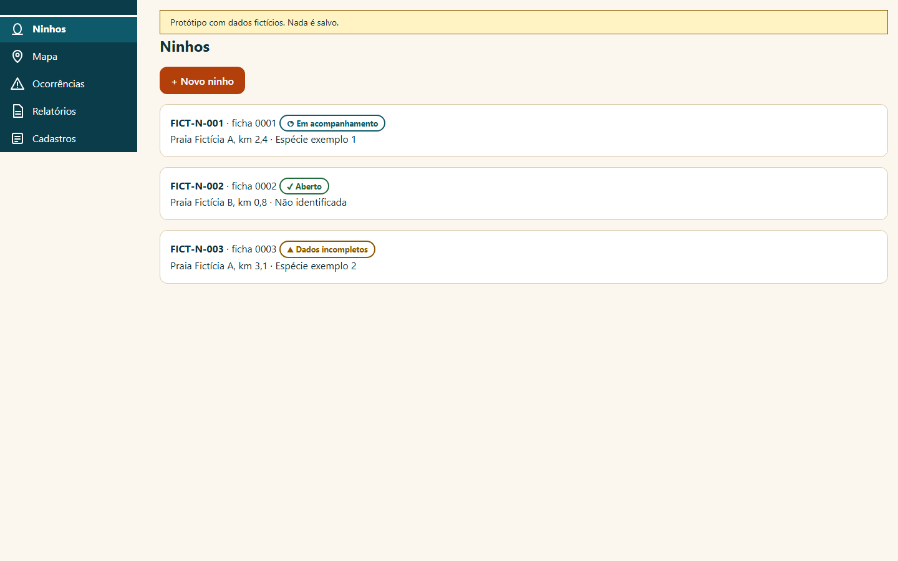
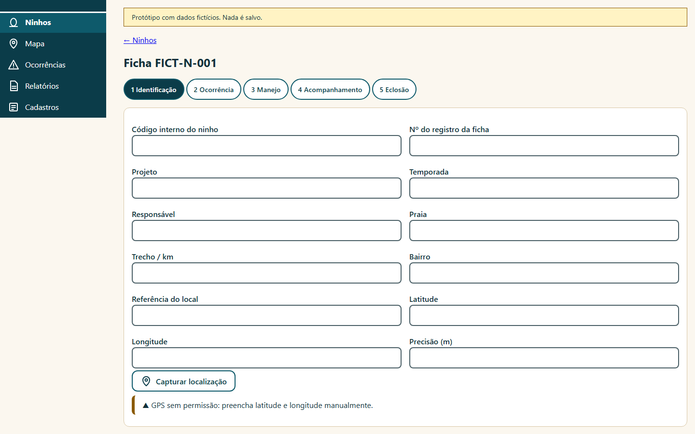
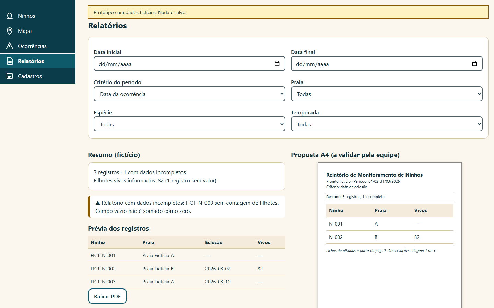
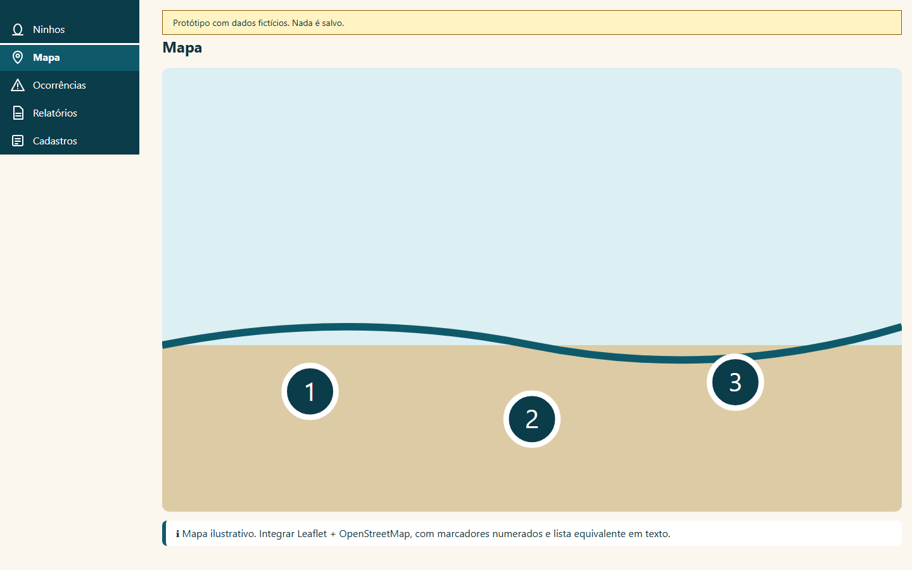
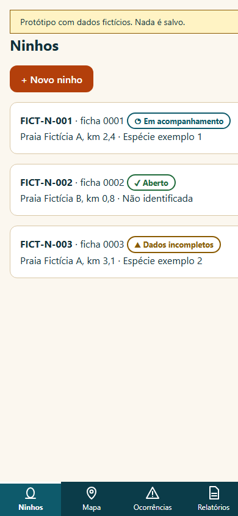
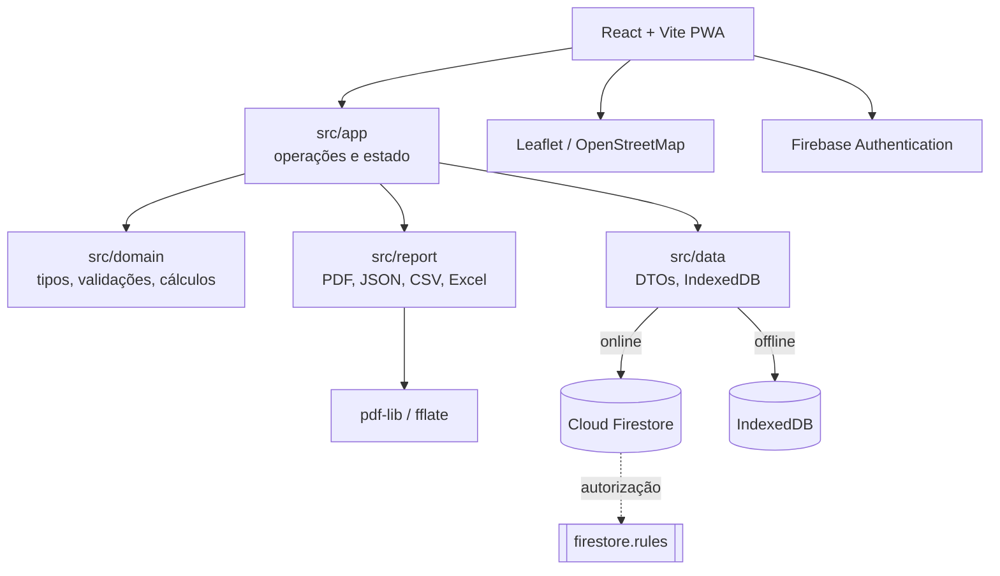
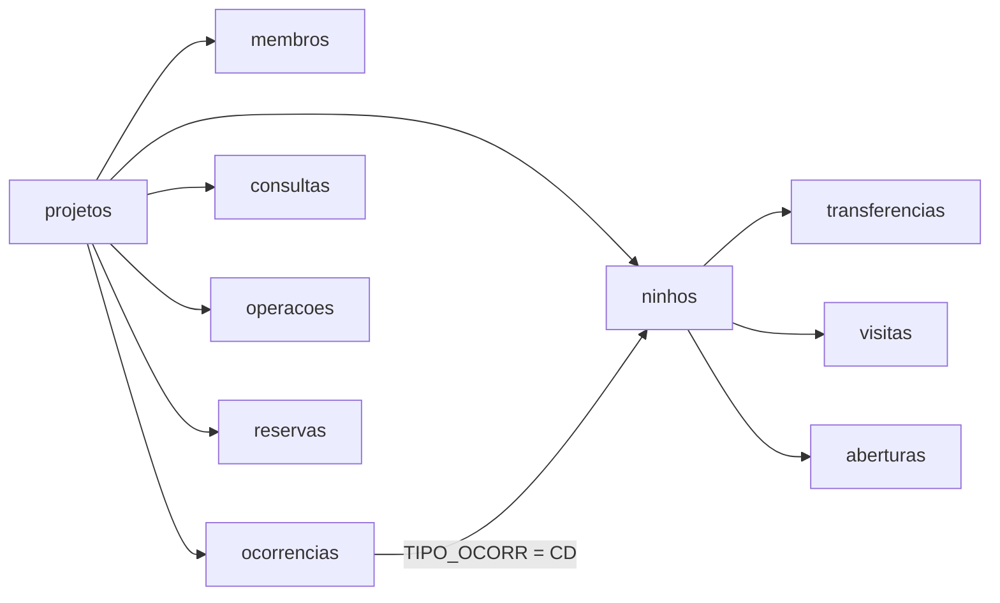

# Monitoramento de Ninhos de Tartarugas

Aplicativo web **offline-first** para um projeto social de conservação: registra ocorrências reprodutivas,
ninhos, transferências, visitas e eclosão/abertura, com geração de relatórios em PDF, JSON, CSV e Excel
direto no navegador. Os dados ficam no **Cloud Firestore**, com acesso controlado por **Firebase
Authentication** e regras de segurança testáveis.

**Aplicativo publicado:** https://monitoramento-de-tartarugas.web.app
*(endereço público; os dados exigem login e vínculo ativo. Nenhuma credencial está no repositório.)*


## Telas do aplicativo

Telas do design aprovado, reproduzidas localmente a partir do protótipo em [`design-preview/`](design-preview/)
— **dados fictícios**, nada é salvo.

<p align="center">
  
  
</p>
<p align="center">
  
  
</p>
<p align="center">
  
</p>

## Sobre o projeto

A equipe registrava ninhos em fichas de papel e coordenadas soltas, perdendo histórico de transferências e
dificultando relatórios por período. O aplicativo nasceu para resolver isso em **campo**, onde muitas vezes
não há internet: o registro é feito no aparelho e só depois sincronizado.

O domínio é tratado com rigor. A fonte científica é um manual de campo transcrito para
[`docs/references/MANUAL-TRANSCRITO.md`](docs/references/MANUAL-TRANSCRITO.md) e destilado em
[dicionário de campos](docs/FIELD_DICTIONARY.md) e [regras de domínio](docs/DOMAIN_RULES.md). O sistema
**não inventa** códigos, fórmulas ou listas de espécies: dúvidas viram perguntas rastreáveis para a
coordenação.

## Destaques técnicos

- **Offline-first real.** Fila de pendências persistida em IndexedDB, uma operação por vez, com estados de
  sincronização explícitos e resolução de conflito sem sobrescrita automática (last-write-wins não é padrão).
- **Regras de segurança testáveis.** Acesso negado por padrão; membros e papéis validados no servidor,
  inclusive barrando auto-promoção a coordenação. Cobertas por testes no emulador do Firestore.
- **Escritas transacionais e auditáveis.** Cada operação gera versão, pré-imagem e registro de auditoria;
  reenvio é idempotente e a origem do ninho é imutável.
- **Cálculos derivados e versionados** (v2), sempre preservando os dados de origem. Vazio, zero observado,
  indeterminado e não aplicável são conceitos distintos — ausência nunca vira `0`.
- **Documentos gerados no cliente, sem backend pago:** PDF A4 com `pdf-lib`, JSON/CSV e Excel (`.xlsx`),
  todos a partir do mesmo snapshot do relatório.
- **PWA instalável** com service worker que separa cache da interface de persistência de dados.
- **Documentação dirigida por tarefas**, decisões registradas (`docs/DECISIONS.md`) e revisão de domínio,
  dados, segurança e offline.

## Funcionalidades

| Área | O que está entregue |
| --- | --- |
| Acesso | Login Firebase Auth e confirmação de membro no projeto. Publicação atual com um único acesso compartilhado de campo; sem auto-cadastro administrativo. |
| Ocorrências | Identificação, datas, localização original, espécie, observações e dados do animal quando aplicáveis. Somente `TIPO_OCORR = CD` cria ninho. |
| Ninhos | Lista, ficha detalhada, estado de acompanhamento e histórico vinculado. Código interno, número de registro e número no cercado são separados. |
| Transferências | Registro próprio de destino, data, ovos, cercado/praia e coordenadas, com captura GPS do destino. Origem preservada. |
| Visitas | Data, condição, eventos e observações de acompanhamento. |
| Eclosão/abertura | Datas, contagens observadas, complementos e correções auditadas. Nova reabertura distinta bloqueada até definição do protocolo. |
| GPS | Captura na origem e no destino, busca da melhor leitura e margem de erro informada pelo aparelho. Entrada manual disponível. |
| Mapa | Leaflet/OpenStreetMap online, posição atual derivada, acesso à ficha pelos marcadores e círculo da margem de erro quando disponível. |
| Relatórios | Todos os ninhos ou intervalo inclusivo por ocorrência, eclosão ou abertura; filtros adicionais e prévia. |
| Exportações | PDF A4, JSON estruturado, CSV tabular e Excel em colunas, todos do mesmo snapshot. |
| Gestão anual | Organização por ano, reserva de números, previsão de eclosão informada e retenção protegida (somente coordenação). |
| Offline | Cache da interface e cópia local do projeto já carregado, pendência durável e conflito explícito. |

Não existem fotos, câmera, upload ou `FOTOGRAFIA` (fora do escopo por decisão do projeto). Comprimento e
largura do casco são apresentados em **cm** (decisão D-022); medidas antigas não são convertidas
silenciosamente.

## Tecnologias

| Tecnologia | Finalidade |
| --- | --- |
| TypeScript | Tipos, contratos, validações e regras dos dados. |
| React + HTML/CSS | Interface responsiva baseada no visual aprovado. |
| Vite | Desenvolvimento e build estático com módulos sob demanda. |
| Firebase SDK modular | Authentication e Cloud Firestore Standard. |
| Firebase Hosting Spark | Publicação estática por HTTPS, sem faturamento. |
| IndexedDB | Cópia local e pendências persistentes. |
| Service worker | Cache dos arquivos da interface, separado dos dados. |
| pdf-lib + fflate | Geração de PDF e `.xlsx` no cliente, sem servidor. |
| Leaflet/OpenStreetMap | Mapa online. |
| Vitest + Firebase Emulator | Testes de comportamento, integração e permissões. |

## Arquitetura



Uma **ocorrência** contém a observação, a localização original e os dados da tartaruga. Quando há desova
(`CD`), um **ninho** referencia a ocorrência. Transferências, visitas e abertura pertencem ao ninho. A
posição atual é derivada do histórico de transferências; a localização original é imutável.



```text
src/app/       operações e estado local/nuvem
src/data/      acesso, DTOs Firestore e IndexedDB
src/domain/    tipos, validações, cálculos e datas
src/features/  acesso, formulários e mapa
src/report/    seleção, apresentação e PDF/JSON/CSV/XLSX
src/services/  Firebase, Auth, configuração, GPS e PWA
src/styles/    estilos da interface
tests/         domínio, relatório, segurança e nuvem
docs/          tarefas, decisões, regras e evidências
design-preview/ protótipo histórico, sem persistência
firestore.rules        autorização e validação no servidor
firestore.indexes.json índices versionados
```

Detalhes de modelo de dados, arquitetura e fluxo: [DATA_MODEL](docs/DATA_MODEL.md),
[ARCHITECTURE](docs/ARCHITECTURE.md), [REPORT_SPEC](docs/REPORT_SPEC.md).

## Como o projeto foi construído

Construção em etapas com ferramentas de IA, sempre com documentação e revisão:

1. **Claude** — identidade visual, cores, componentes, ícones SVG e protótipo, preservados em
   [`docs/design/`](docs/design/) e [`design-preview/`](design-preview/).
2. **OpenCode** — base inicial, contratos, organização e documentação das primeiras tarefas.
3. **Codex** — revisão de domínio e segurança, implementação das etapas seguintes, relatórios, persistência,
   sincronização, Firebase e publicação.

As IAs foram usadas **no desenvolvimento**. Não existe IA dentro do aplicativo. Divisão de trabalho em
[TEAM](docs/TEAM.md); decisões e entregas em [DECISIONS](docs/DECISIONS.md) e
[CHANGELOG](docs/CHANGELOG.md).

## Rodar localmente

Requisitos: Git, npm e Node.js compatível com o Vite (`20.19+` na série 20 ou `22.12+`; validado com Node 24).
Testes de regras/integração exigem Java e Firebase CLI para o emulador.

```powershell
git clone https://github.com/CaioFabio893/app-tartaruga.git
cd app-tartaruga
npm ci
Copy-Item .env.example .env.local
npm run dev
```

Sem `VITE_PROJETO_ID`, a interface mantém um **modo treino** separado, que não grava no projeto oficial nem
migra automaticamente.

<details>
<summary>Variáveis de ambiente (<code>.env.local</code>)</summary>

| Variável | Uso |
| --- | --- |
| `VITE_FIREBASE_API_KEY` | Chave pública do app Web. |
| `VITE_FIREBASE_AUTH_DOMAIN` | Domínio do Authentication. |
| `VITE_FIREBASE_PROJECT_ID` | ID do projeto Firebase. |
| `VITE_FIREBASE_APP_ID` | ID do aplicativo Web. |
| `VITE_FIREBASE_MESSAGING_SENDER_ID` | Campo opcional da configuração Web; não habilita notificações. |
| `VITE_PROJETO_ID` | Projeto lógico Firestore a abrir. |
| `VITE_LOGIN_DOMINIO` | Converte nome curto em e-mail técnico do Auth. |
| `VITE_FIREBASE_USAR_EMULADORES` | `true` apenas em desenvolvimento: força projeto demo e endpoints loopback. |

Variáveis `VITE_*` usadas no código entram no bundle público. **Nunca** colocar senha, token administrativo
ou chave de serviço nelas. A configuração Web não autoriza acesso aos dados — Authentication e as regras do
Firestore fazem isso. Provisionamento detalhado em [DEPLOY](docs/DEPLOY.md).

</details>

## Testes e build

```powershell
# Terminal 1 — emuladores demo (não usar produção)
firebase emulators:start --only auth,firestore --project demo-tartarugas

# Terminal 2
$env:FIRESTORE_EMULATOR_HOST='127.0.0.1:8080'
npx vitest run      # 213 testes passam / 1 opt-in de produção ignorado
npx tsc --noEmit    # checagem de tipos
npx vite build      # build de produção em dist/
npm audit
```

Sem o emulador, os testes que dependem dele são ignorados (191 executam) — isso **não** valida regras. A
prova de escrita em produção é opt-in e fica fora da suíte comum. Cenários e limitações em
[TESTING](docs/TESTING.md).

Validação mais recente (03/10/2026): `tsc --noEmit` **OK**, `vite build` **OK**, `npm audit` **0
vulnerabilidades**, 213 testes passando com emulador.

## Segurança, dados sensíveis e custo

- **Acesso negado por padrão**; membro/papel e projeto são verificados no Firestore. O cliente não se
  promove a coordenação. Escritas exigem transação, revisão, versão, operação nova e pré-imagem.
- **Cache local não significa sincronizado.** Revisão antiga gera conflito, sem sobrescrever automaticamente
  o servidor; adotar o remoto arquiva o rascunho exportável, sem mescla automática.
- Coordenadas, PDFs reais e backups são sensíveis. Não publicar fichas reais nem credenciais no Git. Use as
  pastas ignoradas `exports/` e `backups/`; [`output/pdf/`](output/pdf/) contém apenas demonstrações
  fictícias.
- Plano-alvo **gratuito**: Firestore Standard + Hosting Spark, sem Blaze, Storage, Cloud Functions, Cloud
  Run ou biblioteca paga. Cotas Spark documentadas em [FIREBASE](docs/FIREBASE.md) e
  [estimativa de capacidade](docs/tasks/P05-capacidade-spark.md).

Detalhes: [SECURITY](docs/SECURITY.md), [OFFLINE](docs/OFFLINE.md) e
[revisão de segurança P06](docs/reviews/P06-seguranca.md). Revisão de código e testes não garantem ausência
de vulnerabilidades.

## Documentação

O ponto de entrada é o [índice em `docs/INDEX.md`](docs/INDEX.md). Estado atual em
[STATUS](docs/STATUS.md); regras comuns aos agentes em [`AGENTS.md`](AGENTS.md); histórico de tarefas em
[`docs/tasks/`](docs/tasks/).

## Licença

Distribuído sob a licença [MIT](LICENSE). Projeto social e científico; contribuições e correções de domínio
são bem-vindas mediante as regras de [`AGENTS.md`](AGENTS.md).
